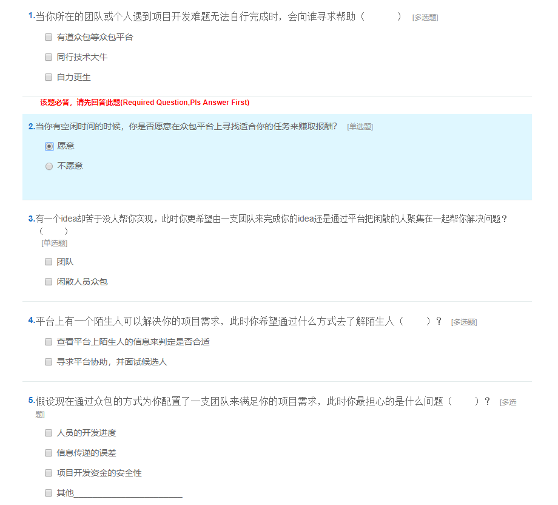

# Customer Validation Report
## Round 1
第一轮我们先通过以有的一些问卷数据来验证众包平台的必要性。
### Questions

### Result Analysis 1

* 从Q1-Q3可以看出大部分用户还是愿意参与一些众包项目，不管是将自已的任务发布给别人去完成，还是自已去完成别人的任务。
* Q3-Q5显示用户更关心的是自已任务的开发进度以及帮忙开发人员的专业程度，所以平台应该要考虑辅助用户找到最合适的人选。

## Round 2
第二轮验证来决定我们的众包平台中任务种类的比例。
### Questions

### Result Analysis 2

* Q7说明了用户最在意商品历史价格追踪功能，其次是全网比价，最后是降价通知。Q8说明了用户对于优惠券，价格走势预测，店铺评分筛选，大V评论等可以帮助其买到更高性价比商品的拓展功能也有需求。

## Conclusion
* 总体上来看，众包平台的发展很有潜力，有越来越多的用户愿意在众包平台上利用自已的业余时间赚取一些报酬，所以帮助用户实现一个能满足他们需求的众包平台很有很有必要。
* 但有一部分用户对促销活动并不关心，所以他们也不太在意通过更多渠道获取信息以确保在较低价买到商品，这部分用户并非比价平台Argus的潜在用户。
* Argus的潜在用户为那些参加促销活动频率较高，更加愿意通过较多渠道确保在较低价买到商品的用户。调研结果显示，他们对于比价网的各项功能（包括全网比较，商品历史价格追踪以及降价通知）均有较高兴趣。但目前这些潜在用户对比价网的了解程度普遍偏低，需要进一步的宣传推广。
* 在三项基本功能之外，用户对于优惠券，价格走势预测，店铺评分筛选，大V评论等可以帮助其买到更高性价比商品的拓展功能也有需求。后续可以考虑对这些拓展功能进行进一步的用户验证以及原型构建。
